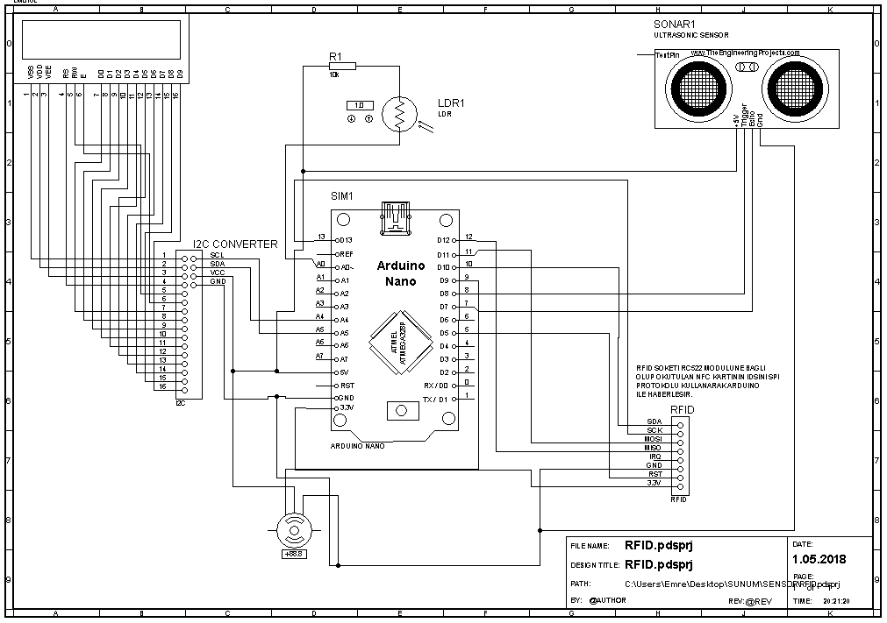

# Arduino RFID Parking Access Control System


**[➡️ Watch the full project demo here](media/project_demo.mp4)**

An open-source, Arduino-based access control system designed for parking barriers using RFID technology. This project provides a solid foundation for a secure and automated vehicle entry system. It features an admin-card function for easy management of authorized users and utilizes an ultrasonic sensor to detect vehicle passage.

This project was originally developed by Emre Güler in 2018 as a university project. Now, it's open to the community for improvements and new features!

---

## ✨ Features

* **RFID-Based Access**: Secure access using 13.56 MHz RFID cards.
* **Admin Card Functionality**:
    * Easily register new user cards.
    * Wipe all registered cards from memory by scanning the admin card twice.
* **Persistent Memory**: Registered card UIDs are stored in the Arduino's EEPROM, so they are not lost when power is disconnected.
* **Automated Barrier Control**: The servo motor automatically opens the barrier for authorized cards.
* **Vehicle Detection**: An HC-SR04 ultrasonic sensor detects when a vehicle has passed, ensuring the barrier closes safely.
* **LCD Display**: A 16x2 LCD screen provides real-time feedback to the user (e.g., "WELCOME!", "UNAUTHORIZED CARD!").
* **Night Mode**: An LDR sensor deactivates the system in the dark to save power.

---

## 🛠️ Hardware Components

| Component | Quantity | Purpose |
| :--- | :---: | :--- |
| Arduino Nano V3 | 1 | The brain of the project (ATmega328P). |
| MFRC522 RFID/NFC Reader | 1 | Reads the 13.56 MHz RFID cards. |
| 16x2 I2C LCD Display | 1 | User feedback screen. |
| TowerPro SG90 Servo Motor| 1 | Operates the parking barrier. |
| HC-SR04 Ultrasonic Sensor | 1 | Detects vehicle presence and passage. |
| LDR (Photoresistor) | 1 | Senses ambient light for night mode. |
| Breadboard & Jumper Wires | - | For circuit assembly. |

---

## 🔌 Schematics & Circuit

The complete circuit diagram is available in the `schematics` folder. You can open the `rfid_system.pdsprj` file with Proteus Design Suite to view and simulate the circuit.

For a quick look, here is the basic wiring diagram:



---

## 🚀 Getting Started

### Prerequisites

1.  **Arduino IDE**: Make sure you have the [Arduino IDE](https://www.arduino.cc/en/software) installed.
2.  **Libraries**: Install the following libraries through the Arduino IDE's Library Manager:
    * `LiquidCrystal_I2C` by Frank de Brabander
    * `MFRC522` by GithubCommunity

### Installation & Usage

1.  **Clone the repository:**
    ```bash
    git clone [https://github.com/emregulerr/arduino-rfid-parking-access-control.git](https://github.com/emregulerr/arduino-rfid-parking-access-control.git)
    ```
2.  **Upload the Sketch**: Open the `rfid_parking_sketch/rfid_parking_sketch_EN.ino` file in the Arduino IDE and upload it to your Arduino Nano.
3.  **Admin Card Setup**: The first card you need is the **Admin Card**. Its UID is hard-coded in the sketch. You need to change the UID in the code to match your desired admin card before uploading.
4.  **Registering User Cards**:
    * Scan the Admin Card. The LCD will display "CARD REG. MODE".
    * Scan a new card you want to authorize. The LCD will confirm with "Card registered."
    * To wipe all registered cards, scan the Admin Card twice in a row.

---

## 🤝 How to Contribute

Contributions are what make the open-source community such an amazing place to learn, inspire, and create. Any contributions you make are **greatly appreciated**. We welcome improvements of any scale!

### Areas for Improvement

Here are a few ideas to get you started:
* **3D Printed Case**: Design a 3D printable enclosure for the components.
* **Enhanced Security**: Implement a mechanism to prevent RFID card cloning.
* **Logging**: Add functionality to log entry/exit times to an SD card.
* **Web Interface**: Create a web interface for managing users and viewing logs (e.g., using an ESP8266/ESP32 instead of a Nano).
* **Code Refactoring**: Improve the code structure, add more comments, or optimize for performance.
* **Documentation**: Enhance the documentation, add more detailed explanations, or translate it into other languages.

### Contribution Steps

1.  **Fork the Project**: Click the 'Fork' button at the top right of this page.
2.  **Create your Feature Branch**:
    ```bash
    git checkout -b feature/AmazingFeature
    ```
3.  **Commit your Changes**:
    ```bash
    git commit -m 'Add some AmazingFeature'
    ```
4.  **Push to the Branch**:
    ```bash
    git push origin feature/AmazingFeature
    ```
5.  **Open a Pull Request**: Go back to the original repository and open a new pull request.

Please make sure your code is well-commented and follows the project's existing style.

---

## 📄 License

This project is distributed under the MIT License. See `LICENSE` file for more information.

---

## 👥 Project Author

* **Emre Güler** - [GitHub](https://github.com/emregulerr)

We hope you find this project useful and fun!
